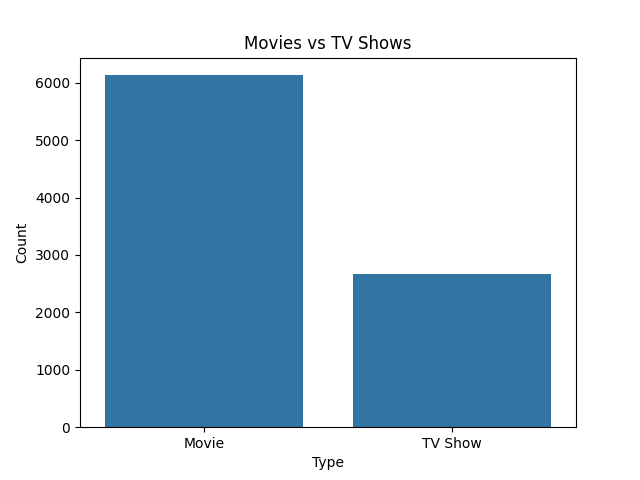
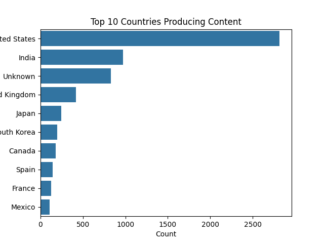
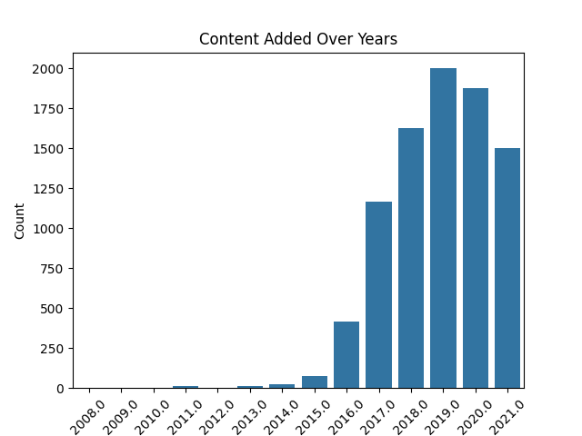
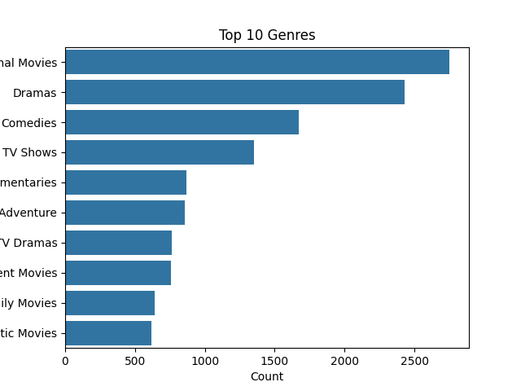

# 📊 Netflix Data Analysis

## 📌 Project Overview
This project analyzes Netflix Movies and TV Shows dataset to uncover trends, patterns, and insights using Python.

## 🛠 Tools & Technologies
- Python
- Pandas
- NumPy
- Seaborn
- Matplotlib

## 📊 Analysis Performed
- Data cleaning and preprocessing
- Handling missing values
- Feature engineering (year extraction)
- Data visualization

## 📈 Key Insights
- Movies dominate Netflix content over TV Shows
- The United States is the leading content producer
- Content additions increased rapidly after 2016
- International Movies are the most popular genre

## 📷 Visualizations

## 🚀 Conclusion
This project demonstrates the ability to clean, analyze, and visualize real-world datasets to derive meaningful insights.
